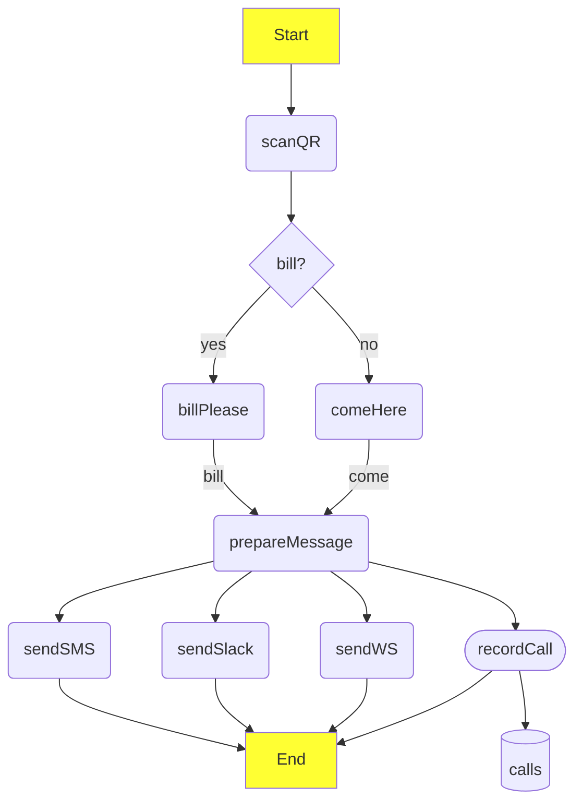

# SuperRice 
## assignment_2
- Clone or download repository
- open archive .html in your browser
- See the model in level 1, 2, 3

```mermaid
graph TD
    Start:::point --> process1(scanQR)
    -->decision1{bill?}
    decision1--> |yes|process2(billPlease)
    decision1--> |no|process3(comeHere) 
    process2-->|bill|process4(prepareMessage)
    process3-->|come|process4(prepareMessage)
    process4-->process5(sendSMS)
    process4-->process6(sendSlack)
    process4-->process7(sendWS)
    process4-->process8([recordCall])
    process8-->process9[(calls)]
    process5-->End
    process6-->End
    process7-->End
    process8-->End:::point
    classDef point fill:#ff3;
```

